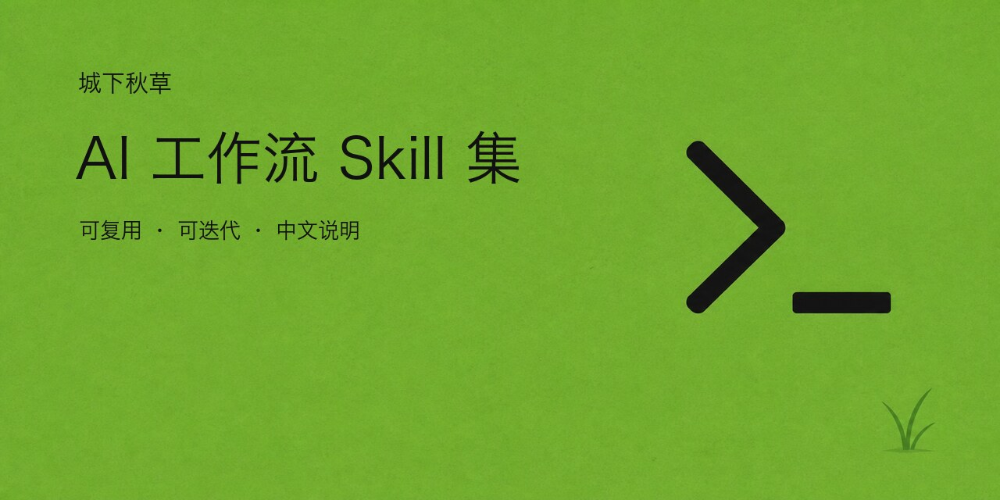

# aki-agent-kit

一套可复用的 AI 开发规则和小工具：帮你准备项目开发说明、保存重要约定、检查项目问题，并在换对话时接着做。



## 安装

```bash
curl -fsSL https://raw.githubusercontent.com/gongfpp/aki-agent-kit/main/scripts/install.sh | bash
```

Skills 安装到 `~/.agents/skills`。普通软件开发选择 `project`；在终端出现选择提示时，直接回车即可。也可以通过参数直接指定组合：

```bash
curl -fsSL https://raw.githubusercontent.com/gongfpp/aki-agent-kit/main/scripts/install.sh \
  | bash -s -- --set project
```

安装时还会把公共开发规则保存到 `~/.agents/aki-agent-kit/rules/`。后续对话优先读取这份本地内容；文件缺失或你要求刷新时才访问远端。再次安装会更新这些规则。

## 有哪些功能？

| Skill | 用途 |
| --- | --- |
| `aki-project-bootstrap` | 准备项目的 AI 开发说明 `AGENTS.md` |
| `aki-context-sync` | 把本次讨论中值得长期保留的约定保存到项目文档 |
| `aki-handoff` | 整理当前对话，让下一个 AI 接着处理同一件事；也能检查并接手指定的交接说明 |
| `aki-project-readme` | 写好项目介绍和使用说明 |
| `aki-project-audit` | 检查软件项目的问题，说明影响并提出改进建议 |
| `aki-open-source-audit` | 检查公开前是否还有密码、私人数据、素材授权等问题 |
| `aki-game-audit` | 检查游戏体验、运行问题和后续制作成本 |
| `aki-grill-with-context` | 把想法讨论清楚，在你确认后保存重要结论 |
| `aki-rednote-cover` | 制作带三颗草和用户名的个人小红书封面 |

`godot` 组合还包含外部工具说明 `gda`，用于操作 Godot、运行游戏并获取截图和日志。实际操作需要安装对应工具，安装器会在缺少工具时提示。

## 选择安装组合

| 参数 | 适合的用途 |
| --- | --- |
| `--set core` | 只准备开发说明、保存讨论约定 |
| `--set project` | 日常软件开发 |
| `--set game` | 通用游戏开发 |
| `--set godot` | 游戏开发，加上 Godot 操作工具说明 |
| `--set opensource` | 软件开发，加上公开前检查 |
| `--set all` | 全部功能，包括个人封面工具 |

用 `--list` 查看当前组合和全部 Skill。只需要其中几个时，用 `--skills` 指定名称，安装器会补齐它们需要的其他 Skill：

```bash
curl -fsSL https://raw.githubusercontent.com/gongfpp/aki-agent-kit/main/scripts/install.sh \
  | bash -s -- --skills aki-project-bootstrap,aki-handoff
```

使用相同参数再次运行即可更新。**本安装器以前安装、但本次没有选择的 Skill 会被移除**；不是本安装器创建的同名目录不会被覆盖。

## 怎么使用？

在 AI 开发工具中开启对话，直接说 Skill 名称和需求：

```text
使用 aki-project-bootstrap 准备当前项目的开发说明。
使用 aki-grill-with-context 帮我把这个想法讨论清楚。
使用 aki-context-sync 把这次讨论的重要约定保存到项目文档。
使用 aki-handoff 交接当前对话，让新对话继续这件事。
使用 aki-handoff 根据这份交接说明，核对进度后接着做。
使用 aki-project-readme 改善项目介绍和使用说明。
使用 aki-project-audit 检查当前软件项目有哪些值得解决的问题。
使用 aki-open-source-audit 检查这个项目公开前还要处理什么。
使用 aki-game-audit 检查当前游戏有哪些游玩和实现问题。
使用 gda 运行当前 Godot 项目并获取截图和日志。
```

没有识别到刚安装的 Skill 时，新开对话或重启开发工具。

`aki-handoff` 默认只交接当前对话。一个项目里有多段聊天时，项目文件仅用于核对相关结果；需要汇总其他对话时，请明确指定范围。

## 开发规则放在哪里？

`principles/` 保存通用开发、游戏开发、Git 版本管理、项目精简和 Skill 编写规则。具体项目的目录、功能、玩法和操作方式仍以项目自己的说明为准。

面向用户的回复先说实际结果和影响，必要技术词会解释；工具内部数据、准确命令和文件名仍保持原样。
